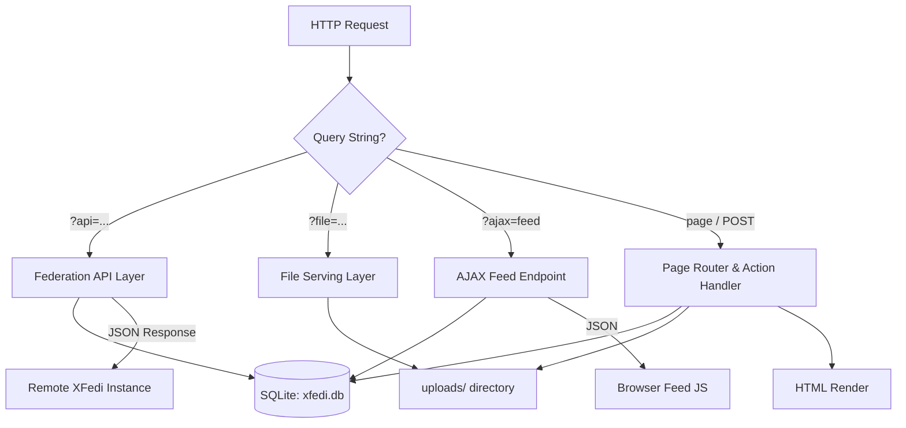
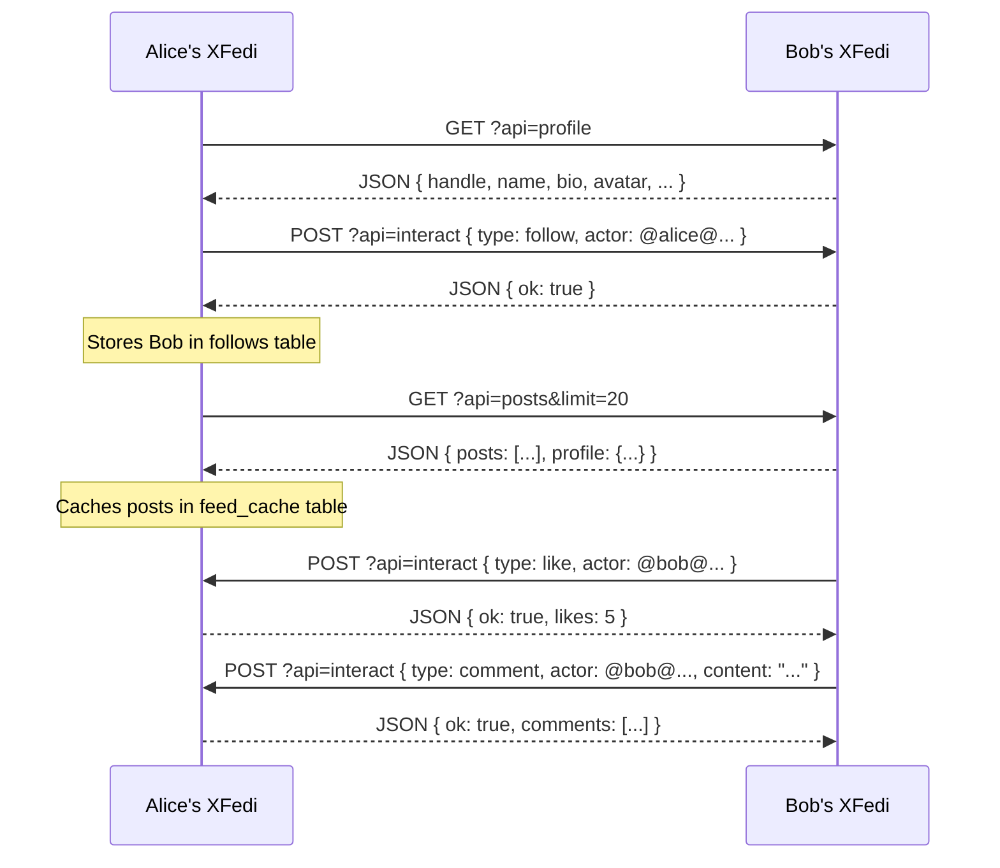
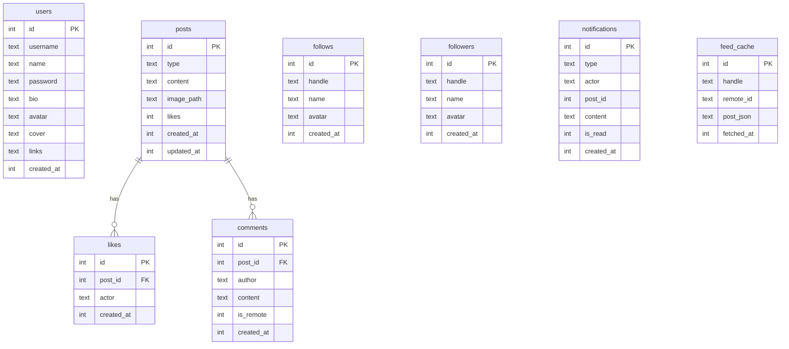
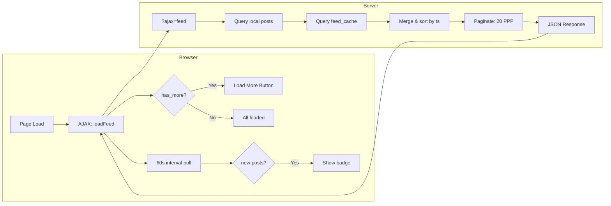

# XFedi - xsukax Federated Social Media Platform
> **A self-hosted, single-file federated social media platform built in PHP.**

[](https://www.gnu.org/licenses/gpl-3.0)
[](https://www.php.net/)
[](https://www.sqlite.org/)
[](https://github.com/xsukax/XFedi)

---

## Table of Contents

- [Project Overview](#project-overview)
- [Security and Privacy Benefits](#security-and-privacy-benefits)
- [Features and Advantages](#features-and-advantages)
- [Installation Instructions](#installation-instructions)
- [php.ini Configuration](#phpini-configuration)
- [Usage Guide](#usage-guide)
- [Architecture & Diagrams](#architecture--diagrams)
- [API Reference](#api-reference)
- [Licensing Information](#licensing-information)

---

## Project Overview

**XFedi** is a lightweight, fully self-hosted federated social media platform delivered as a **single PHP file** (`xfedi.php`). It requires no frameworks, no Composer dependencies, and no complex infrastructure — just a PHP-enabled web server and a writable directory.

At its core, XFedi enables you to own your social identity. You run your own instance, publish posts (text and images), and interact with users on other XFedi instances through a simple JSON-based federation API. It is purpose-built for developers, privacy-conscious individuals, and small communities who want the social web experience without surrendering their data to centralized platforms.

The entire application — routing, database schema, federation logic, file serving, and UI — lives within `xfedi.php`. A SQLite database (`xfedi.db`) and an `uploads/` directory are auto-created on first run. Nothing else is needed.

---

## Security and Privacy Benefits

XFedi has been designed from the ground up with security and user privacy as first-class concerns.

### Cross-Site Request Forgery (CSRF) Protection
Every state-changing POST action requires a valid CSRF token, generated with `random_bytes(16)` and validated via `hash_equals()` — resistant to timing-based attacks. No form submission is processed without it.

### Password Security
User passwords are stored exclusively as hashes using PHP's `password_hash()` with the `PASSWORD_DEFAULT` algorithm (bcrypt). Plain-text passwords are never persisted anywhere in the system. The minimum enforced password length is 8 characters.

### Session Security
On login and first-run setup, `session_regenerate_id(true)` is called to issue a new session ID and invalidate the old one, protecting against session fixation attacks.

### XSS Prevention
All user-supplied content rendered in HTML is escaped through a dedicated `h()` helper built on `htmlspecialchars()` with `ENT_QUOTES | ENT_SUBSTITUTE` and UTF-8 encoding. URLs within post content are linkified safely, ensuring no user-generated markup can execute in a browser.

### Secure File Upload Handling
Uploaded images are validated on two independent axes:
- **MIME type** — verified via `mime_content_type()` against an explicit allowlist (`image/jpeg`, `image/png`, `image/gif`, `image/webp`).
- **File extension** — validated against its own allowlist independently of the MIME check.

Stored filenames are replaced with cryptographically random names (`bin2hex(random_bytes(8))`), preventing enumeration and path-based attacks. File size limits are enforced server-side (5 MB for avatars/covers, 10 MB for post images).

### Upload Directory Hardening
At startup, XFedi automatically writes an `.htaccess` file into the `uploads/` directory that disables directory indexing and turns off PHP execution — ensuring that even if a file were somehow written there, it cannot be executed as a script.

### SQL Injection Prevention
All database interactions use PDO prepared statements with parameterized queries. Raw SQL string interpolation with user data does not occur anywhere in the codebase. The SQLite connection operates in exception mode (`PDO::ERRMODE_EXCEPTION`) with foreign keys enforced.

### Data Ownership and Sovereignty
Your data lives entirely on your own server. There are no third-party analytics, no advertising SDKs, no external tracking pixels, and no telemetry calls home. Federation is peer-to-peer between XFedi instances you choose to follow.

### Federation Input Sanitization
Remote interaction payloads (likes, comments, follow events) received via the federation API are sanitized: actor handles are filtered with a strict regex, content is stripped of HTML tags, and all values are clamped to safe lengths before being written to the database.

---

## Features and Advantages

### Core Functionality
- **Text and image posts** with a 500-character limit per post, supporting edit and delete operations.
- **Likes and comments** — both local (on your instance) and cross-instance via the federation API.
- **User profile** with display name, bio, avatar, cover photo, and up to multiple custom links.
- **Notifications** for incoming likes, comments, and follow events from remote instances.
- **Password management** with current-password verification and confirmation matching.

### Federation
- Follow remote XFedi users by their federated handle (`@username@host/xfedi.php`).
- View remote profiles, their posts, and their followers directly from your instance.
- Like and comment on remote posts — interactions are relayed to the origin server.
- Feed cache stores remote posts locally, enabling a unified home feed blending local and remote content.
- Automatic sync fetches up to 5 random followed instances per refresh cycle, updating cached posts and profile metadata.

### User Interface
- Clean, responsive single-page interface optimized for both desktop and mobile.
- Sticky top navigation with unread notification badge.
- Infinite-scroll home feed loaded via AJAX, with a "Load more" button and auto-poll for new posts every 60 seconds.
- Relative timestamps (`5m`, `2h`, `3d`) with full date fallback for older posts.
- Graceful avatar fallback — displays initials when an avatar image is unavailable or fails to load.

### Technical Advantages
- **Zero dependencies** — no Composer, no npm, no build step.
- **Single-file deployment** — the entire application is `xfedi.php`.
- **SQLite** — no database server required; WAL mode enabled for concurrent read performance.
- **Self-contained federation** — no ActivityPub complexity; a clean, discoverable JSON API.
- **Automatic bootstrapping** — database tables and the upload directory are created on first request.

---

## Installation Instructions

### Requirements
- PHP **8.1** or later
- The following PHP extensions enabled: `pdo`, `pdo_sqlite`, `fileinfo`, `json`, `session`
- A web server (Apache, Nginx, Caddy, or PHP's built-in server)
- HTTPS strongly recommended for production deployments

### Step 1 — Download the Application

Clone the repository or download `xfedi.php` directly:

```bash
git clone https://github.com/xsukax/XFedi.git
cd XFedi
```

Or download the single file:

```bash
wget https://raw.githubusercontent.com/xsukax/XFedi/main/xfedi.php
```

### Step 2 — Place the File on Your Server

Copy `xfedi.php` to your web root or a subdirectory:

```bash
cp xfedi.php /var/www/html/xfedi.php
```

### Step 3 — Set Directory Permissions

XFedi needs to create `xfedi.db` and the `uploads/` directory in the same folder as `xfedi.php`. Ensure the web server user has write access:

```bash
chown www-data:www-data /var/www/html/
chmod 755 /var/www/html/
```

### Step 4 — Configure Your Web Server

**Apache** — ensure `mod_rewrite` is not required (XFedi uses query strings natively). A minimal virtual host:

```apache
<VirtualHost *:443>
    ServerName yourdomain.com
    DocumentRoot /var/www/html
    <Directory /var/www/html>
        AllowOverride All
        Require all granted
    </Directory>
    SSLEngine on
    SSLCertificateFile    /etc/ssl/certs/your_cert.pem
    SSLCertificateKeyFile /etc/ssl/private/your_key.pem
</VirtualHost>
```

**Nginx** — a minimal server block:

```nginx
server {
    listen 443 ssl;
    server_name yourdomain.com;
    root /var/www/html;
    index xfedi.php;

    ssl_certificate     /etc/ssl/certs/your_cert.pem;
    ssl_certificate_key /etc/ssl/private/your_key.pem;

    location / {
        try_files $uri $uri/ /xfedi.php?$query_string;
    }

    location ~ \.php$ {
        include fastcgi_params;
        fastcgi_pass unix:/run/php/php8.2-fpm.sock;
        fastcgi_param SCRIPT_FILENAME $document_root$fastcgi_script_name;
    }

    location /uploads/ {
        deny all;
    }
}
```

**PHP Built-in Server** (development only):

```bash
php -S localhost:8080 xfedi.php
```

### Step 5 — First-Run Setup

Navigate to `https://yourdomain.com/xfedi.php` in your browser. You will be presented with a one-time setup screen prompting you to choose a username (3–30 characters: lowercase letters, numbers, and underscores). After submission, you are logged in automatically.

**Change your password immediately** after first login via **Settings → Change Password**. The default password is `admin@123`.

---

## php.ini Configuration

XFedi relies on several PHP settings that must be properly configured for correct and secure operation. Review and adjust the following directives in your `php.ini` (commonly located at `/etc/php/8.x/fpm/php.ini` or `/etc/php/8.x/apache2/php.ini`):

```ini
; File uploads — required for avatar, cover, and post image uploads
file_uploads = On
upload_max_filesize = 10M
post_max_size = 12M

; Execution time — increase if federation sync calls are slow
max_execution_time = 30

; Session security — strongly recommended for production
session.cookie_httponly = 1
session.cookie_secure = 1
session.use_strict_mode = 1
session.cookie_samesite = Lax

; SQLite PDO — must be enabled
extension = pdo_sqlite

; File info — required for MIME type validation on uploads
extension = fileinfo

; JSON — typically compiled in; verify it is available
extension = json

; Memory — sufficient for image handling
memory_limit = 128M
```

After editing `php.ini`, restart your PHP process:

```bash
# PHP-FPM
sudo systemctl restart php8.2-fpm

# Apache with mod_php
sudo systemctl restart apache2
```

Verify your configuration by creating a temporary `phpinfo()` page and confirming `pdo_sqlite`, `fileinfo`, and `session` are listed as active extensions. **Remove the info page before going live.**

---

## Usage Guide

### First Login and Password Change

After completing the setup wizard, navigate to **Settings** (gear icon in the top navigation) and immediately change your password under the **Security** section. Enter your current password (`admin@123`), a new password of at least 8 characters, and confirm it.

### Creating a Post

From the **Home** feed, use the composer at the top of the page:

1. Type your content (up to 500 characters) in the text area.
2. To attach an image, select the image post type and choose a JPEG, PNG, GIF, or WebP file (max 10 MB).
3. Click **Post** to publish.

Your post appears in your feed immediately and is available to remote instances via the federation API.

### Editing and Deleting Posts

Open a post by clicking on it. If you are logged in, **Edit** and **Delete** buttons are available on your own posts. Editing updates the post content and marks it with an "edited" badge. Deleting removes the post, its associated comments, likes, and any stored image file.

### Following Remote Instances

Navigate to **Following** from the navigation bar. Enter a federated handle in the format:

```
@username@hostname/xfedi.php
```

Click **Follow**. XFedi will:
1. Fetch the remote profile via the federation API.
2. Store the handle, display name, and avatar locally.
3. Send a follow notification to the remote instance.

Remote posts from followed accounts appear in your home feed after the next sync.

### Syncing the Feed

On the home feed, click the **🔄 Sync** button to trigger an immediate fetch from up to 5 followed instances. New posts are prepended to the top of the feed. The feed also auto-polls every 60 seconds and displays a badge when new posts are available.

### Viewing Remote Profiles

Click on a remote account's handle or avatar anywhere in the feed or notification list. This opens the remote profile page, which displays the fetched profile data, their recent posts, and their follower list — all fetched live from the remote instance.

### Notifications

The bell icon in the navigation bar shows a badge count for unread notifications. Click it to view a list of recent likes, comments, and follow events. Viewing the notifications page marks all as read.

### Managing Your Profile

Navigate to **Settings** to update your display name, bio, avatar, cover image, and up to several custom links. All fields are optional; changes are saved immediately on form submission.

---

## Architecture & Diagrams

### Application Flow



### Federation Protocol Flow



### Database Schema



### Request Lifecycle



---

## API Reference

XFedi exposes a public JSON API consumed by other XFedi instances for federation. All endpoints are accessed via query string parameters on the main script URL.

| Endpoint | Method | Description |
|---|---|---|
| `?api=profile` | GET | Returns the instance owner's profile data. |
| `?api=posts&limit=N&since=T` | GET | Returns recent posts, optionally filtered by timestamp. |
| `?api=post&id=N` | GET | Returns a single post with its full comment list. |
| `?api=followers&limit=N` | GET | Returns the instance's follower list. |
| `?api=interact` | POST | Accepts federation interactions: `like`, `comment`, `follow`, `unfollow`. |

All endpoints return `Content-Type: application/json` and include `Access-Control-Allow-Origin: *` for cross-origin federation.

**Example — fetch a remote profile:**

```bash
curl https://remote-instance.example.com/xfedi.php?api=profile
```

**Example — send a follow interaction:**

```bash
curl -X POST https://remote-instance.example.com/xfedi.php?api=interact \
  -H "Content-Type: application/json" \
  -d '{"type":"follow","actor":"@alice@myinstance.example.com/xfedi.php","name":"Alice","avatar":""}'
```

---

## File Structure

After first run, your deployment directory will contain:

```
xfedi.php          ← The entire application
xfedi.db           ← Auto-created SQLite database
uploads/           ← Auto-created directory for media files
uploads/.htaccess  ← Auto-written: disables indexing and PHP execution
```

No other files are required. To back up your instance, copy `xfedi.db` and the `uploads/` directory.

---

## Licensing Information

This project is licensed under the GNU General Public License v3.0 — see the [LICENSE](https://www.gnu.org/licenses/gpl-3.0.html) file or the header of `xfedi.php` for full terms.
