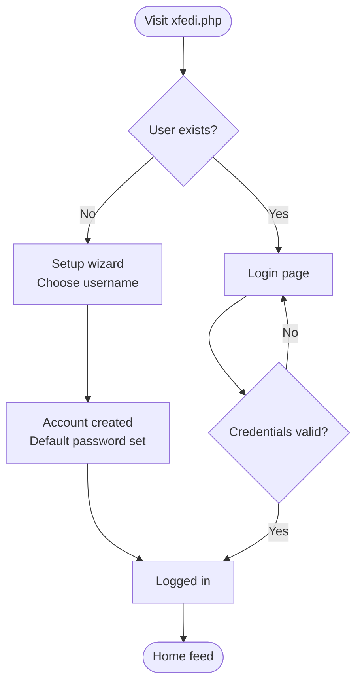
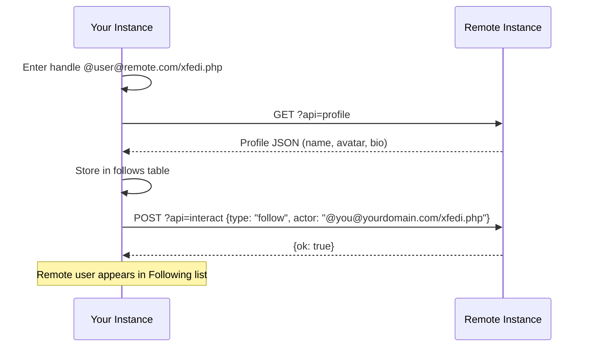
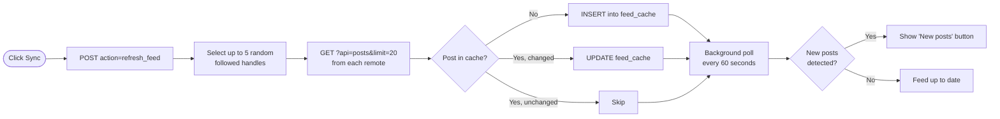
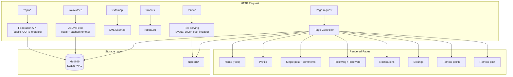
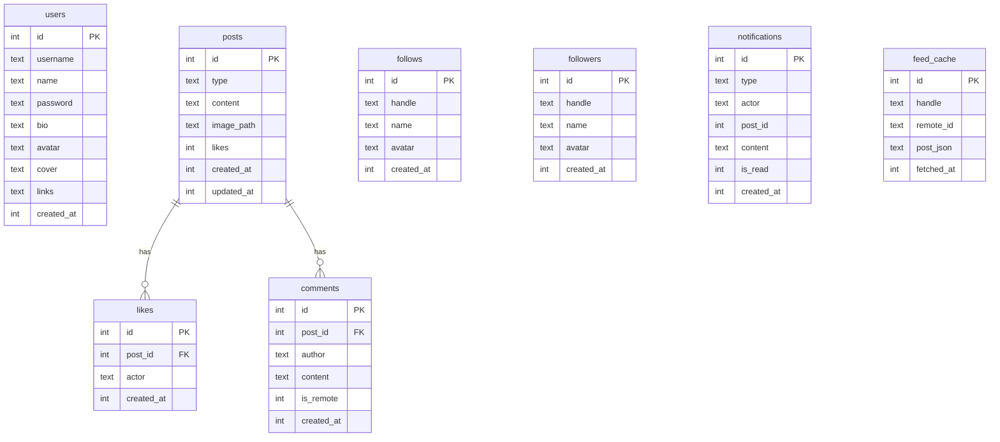

# XFedi ✦

> **A single-file, self-hosted federated social media platform built in PHP.**

[](https://www.gnu.org/licenses/gpl-3.0)
[](https://php.net)
[](https://sqlite.org)
[](https://github.com/xsukax/XFedi)

---

**Check my Instance:** [https://xsukax.net/xfedi.php](https://xsukax.net/xfedi.php) 

---

## Table of Contents

- [Project Overview](#project-overview)
- [Security & Privacy](#security--privacy)
- [Features & Advantages](#features--advantages)
- [Requirements](#requirements)
- [Installation](#installation)
- [php.ini Configuration](#phpini-configuration)
- [Usage Guide](#usage-guide)
- [Architecture & Flow](#architecture--flow)
- [Federation API](#federation-api)
- [License](#license)

---

## Project Overview

**XFedi** is a privacy-first, self-hosted federated social media platform delivered as a single PHP file (`xfedi.php`). It enables individuals to own and control their social presence without relying on third-party infrastructure. Instances of XFedi can federate with one another — users can follow remote accounts, receive posts from followed instances into a unified feed, and interact (like, comment) across server boundaries, all through a clean, lightweight API.

XFedi is designed for developers, privacy-conscious individuals, and communities who want the social web without sacrificing data sovereignty. The entire stack — database, file storage, authentication, federation engine, and web UI — lives in one deployable file with **zero external dependencies**.

---

## Security & Privacy

XFedi integrates multiple layers of security and privacy protection by design:

| Concern | Mitigation |
|---|---|
| **CSRF attacks** | Every mutating POST action requires a server-generated, session-bound CSRF token validated via `hash_equals()` (constant-time comparison). |
| **Password storage** | Passwords are hashed using PHP's `password_hash()` with `PASSWORD_DEFAULT` (bcrypt). Plain-text passwords are never stored or logged. |
| **Session fixation** | `session_regenerate_id(true)` is called on every successful login to invalidate the prior session ID. |
| **File upload safety** | Uploaded files are validated by MIME type (`mime_content_type()`) and extension whitelist. Filenames are randomised using `bin2hex(random_bytes(8))` to prevent enumeration. |
| **Upload directory hardening** | The `uploads/` directory is automatically provisioned with an `.htaccess` that disables directory indexing and PHP execution (`php_flag engine off`). |
| **Output encoding** | All user-supplied data rendered in HTML passes through `htmlspecialchars()` with `ENT_QUOTES | ENT_SUBSTITUTE` to prevent XSS. |
| **SQL injection** | All database queries use PDO prepared statements with parameterised bindings. |
| **Remote actor validation** | Remote federation handles are validated against a strict regex (`@user@domain`) before any network request or database write. |
| **Remote avatar / URL trust** | Remote avatar URLs are validated with `FILTER_VALIDATE_URL` before storage. |
| **Input length clamping** | Actor handles, comment content, and profile fields are clamped to defined maximum lengths server-side before persistence. |
| **Private page gating** | Settings, notifications, followers, and following pages require an authenticated session; unauthenticated access is redirected to the login page. |
| **SEO robots control** | Private pages emit `noindex,nofollow` robots meta tags to prevent search engine indexing of sensitive user data. |
| **Data sovereignty** | All data is stored locally in an SQLite database (`xfedi.db`) and `uploads/` on your own server — no third-party services, tracking scripts, or CDN dependencies. |

---

## Features & Advantages

- **Truly single-file** — deploy by uploading one file; no Composer, no npm, no build step.
- **Federated by design** — follow remote XFedi instances via `@user@domain/path/xfedi.php` handles; posts from followed instances are cached and surfaced in your home feed.
- **Cross-instance interaction** — like and comment on remote posts; interactions are delivered to the origin server via the federation API.
- **Rich post types** — text posts and image posts (JPEG, PNG, GIF, WebP) up to 10 MB.
- **Responsive GitHub-inspired UI** — desktop sidebar layout + mobile bottom navigation; works on all screen sizes.
- **Live feed polling** — background 60-second interval checks for new posts; one-click "Sync" to pull fresh content from followed instances.
- **Full profile customisation** — display name, bio, avatar, cover photo, and external links.
- **SEO-ready** — Open Graph, Twitter Card, canonical URLs, JSON-LD structured data, auto-generated XML sitemap, and robots.txt endpoint.
- **Notifications** — tracks likes, comments, and follows from both local actions and remote federation interactions.
- **Zero external dependencies** — no JavaScript frameworks, no CSS libraries, no third-party API calls.
- **WAL-mode SQLite** — Write-Ahead Logging for improved concurrent read performance.
- **GPL-3.0 licensed** — fully open source and auditable.

---

## Requirements

- **PHP** 8.0 or later
- **PHP extensions:** `pdo_sqlite`, `fileinfo`, `session`, `json`, `mbstring`
- **Web server:** Apache (with `mod_rewrite` optional), Nginx, Caddy, or PHP built-in server
- **SQLite 3** (bundled with PHP on most distributions)
- Write permissions on the directory containing `xfedi.php`

---

## Installation

### 1. Download

```bash
git clone https://github.com/xsukax/XFedi.git
cd XFedi
```

Or download `xfedi.php` directly:

```bash
wget https://raw.githubusercontent.com/xsukax/XFedi/main/xfedi.php
```

### 2. Deploy

Place `xfedi.php` in a publicly accessible directory on your web server.

```
/var/www/html/
└── xfedi.php        ← the application
```

The following paths are created automatically on first run:

```
/var/www/html/
├── xfedi.php
├── xfedi.db         ← SQLite database (auto-created)
└── uploads/
    └── .htaccess    ← security rules (auto-created)
```

### 3. Set permissions

```bash
chmod 755 /var/www/html/
chown www-data:www-data /var/www/html/
```

### 4. Apache virtual host (example)

```apache
<VirtualHost *:80>
    ServerName yourdomain.com
    DocumentRoot /var/www/html

    <Directory /var/www/html>
        AllowOverride All
        Require all granted
    </Directory>
</VirtualHost>
```

### 5. Nginx server block (example)

```nginx
server {
    listen 80;
    server_name yourdomain.com;
    root /var/www/html;
    index xfedi.php;

    location / {
        try_files $uri $uri/ /xfedi.php?$query_string;
    }

    location ~ \.php$ {
        fastcgi_pass unix:/run/php/php8.2-fpm.sock;
        fastcgi_param SCRIPT_FILENAME $document_root$fastcgi_script_name;
        include fastcgi_params;
    }

    # Block direct access to the database
    location ~* \.(db|sqlite)$ {
        deny all;
    }
}
```

### 6. First run

Navigate to `https://yourdomain.com/xfedi.php` in your browser. You will be greeted with the setup wizard — choose your username (lowercase, 3–30 characters, numbers and underscores allowed).

> ⚠️ **Important:** The default password is `admin@123`. Change it immediately after setup via **Settings → Change Password**.

---

## php.ini Configuration

The following `php.ini` settings are recommended to ensure XFedi operates correctly, especially for image uploads and federation HTTP requests:

```ini
; Allow larger file uploads for image posts (XFedi default max: 10 MB)
upload_max_filesize = 12M
post_max_size = 14M

; Enable file uploads
file_uploads = On

; Raise memory limit for image processing
memory_limit = 128M

; Allow outbound HTTP requests for federation (fedFetch uses file_get_contents)
allow_url_fopen = On

; Recommended session security settings
session.cookie_httponly = 1
session.cookie_secure = 1
session.use_strict_mode = 1

; Timezone (set to your local timezone)
date.timezone = UTC

; Required extensions (ensure these are enabled)
extension = pdo_sqlite
extension = fileinfo
extension = mbstring
```

After editing `php.ini`, restart your PHP-FPM or web server:

```bash
# PHP-FPM
sudo systemctl restart php8.2-fpm

# Apache with mod_php
sudo systemctl restart apache2
```

> **Note:** `allow_url_fopen = On` is required for federation — XFedi uses `file_get_contents()` with a stream context to fetch remote profile data and post feeds. If your host disables this, federation features will be unavailable but the local instance will continue to function normally.

---

## Usage Guide

### First-time Setup



### Creating a Post

1. Navigate to the **Home** page.
2. Select **Text** or **Image** tab in the compose box.
3. Write your content (up to 500 characters).
4. For image posts, tap or drag an image into the upload zone.
5. Click **Post**.

### Following a Remote Instance



**Handle format:**
```
@username@domain.com/path/to/xfedi.php
```

### Feed Synchronisation



### Interacting with Remote Posts

- **Like** — Sends a `POST ?api=interact` request with `{type: "like"}` to the origin server. The like count updates in real time.
- **Comment** — Delivered to the origin server via the interact API. Your federated handle (`@you@yourdomain.com/xfedi.php`) is recorded as the author.
- **Share** — Uses the Web Share API (mobile) or copies the post URL to clipboard.

### Profile Management

Navigate to **Settings** to:
- Update display name, bio, and external links
- Upload a profile picture (400×400 px recommended) and cover photo (1500×500 px recommended)
- Change your password
- View your shareable federation handle
- Access SEO endpoints (sitemap, robots.txt)

---

## Architecture & Flow



### Database Schema



---

## Federation API

XFedi exposes a public JSON API that enables federation between instances. All endpoints are accessible without authentication.

| Endpoint | Method | Description |
|---|---|---|
| `?api=profile` | GET | Returns the instance owner's profile data |
| `?api=posts` | GET | Returns recent posts (`limit`, `since` params supported) |
| `?api=post&id={n}` | GET | Returns a single post with comments |
| `?api=followers` | GET | Returns the followers list |
| `?api=interact` | POST | Accepts `like`, `comment`, `follow`, `unfollow` actions |

**Example: fetch a remote profile**
```bash
curl "https://remote.example.com/xfedi.php?api=profile"
```

**Example: send a follow action**
```bash
curl -X POST "https://remote.example.com/xfedi.php?api=interact" \
  -H "Content-Type: application/json" \
  -d '{"type":"follow","actor":"@you@yourdomain.com/xfedi.php","name":"Your Name","avatar":""}'
```

---

## License

This project is licensed under the **GNU General Public License v3.0** — see the [LICENSE](https://www.gnu.org/licenses/gpl-3.0.html) file for details.

---

<div align="center">
  <sub>Built with ❤️ by <a href="https://github.com/xsukax">xsukax</a> · <a href="https://github.com/xsukax/XFedi">GitHub Repository</a></sub>
</div>
